⚠️ **Disclaimer:** PlanetTechJS is currently in its alpha version and is being developed by a single developer. Consequently, it's important to keep in mind that there may be bugs, spelling errors, lack of tests, and occasional inconsistencies in the library. While every effort is being made to provide a stable and enjoyable experience, please approach the library with the understanding that it's a work in progress. Your feedback, bug reports, and contributions are highly appreciated as they play a crucial role in improving the library and ensuring its quality.


# PlanetTechJS (ALPHA V0.0) 


<p align="center">
  
</p>


**GOAL:**
GOAL: PlanetTechJS is an open-source JavaScript library built using vanilla THREE.js, accompanied by a React UI for editing planets. Its primary purpose is to generate procedural planets and terrains using a quadtree LOD approach. The aim of this project is not to replicate titles like Star Citizen or No Man's Sky, but rather to provide a toolkit that emulates the tools they might employ for planet creation. The sole focus is on crafting planets, offering a straightforward and adaptable approach to designing realistic and visually captivating 3D planets on a grand scale. The key to the success of this project lies in its ability to handle **scale**, allowing for seamless transitions from the sky to the ground with high resolution. PlanetTechJS will include customizable features such as terrain textures, ground physics, atmospheric effects, and more. Thus, it does not encompass spaceships, weapons, player dynamics, etc.; its sole focus is planet generation.

What sets this library apart is its utilization of the GPU for all tasks. This includes generating textures for each facet, performing displacement, and shaping PlaneGeometries into spherical forms; the entire process occurs on the GPU. Consequently, there is no need for WebWorkers at this stage.

## Getting Started
Download and run the project. Go to http://localhost:3001/. The file for the demo is located at src/lib/viewGL.js. If things aren't working, open an issue, and I will try to correct any problems.

⚠️ **Disclaimer:** Because this is in alpha, and I haven't fully implemented good first-person controls yet, in the demo, you need to find a spot on the front face of the planet. Make sure to orient and rotate the camera to your liking. Hold down the right mouse key to move the red cube; this is currently how I activate the quadtree. Finding the cube can be challenging due to the scale of the planet. However, holding down the right mouse clicker activates the quadtree. I plan to implement basic character controls, but for now, this is the method I'm using. Alternatively, you can adjust the scale or speed of the cube. It's located in the initPlayer method in src/lib/viewGL.js

## Features/Ideas
- Procedural planet generation: Create unique and realistic planets using procedural algorithms.
- flexability and speed.
- quadtree sphere.
- cubeMap. (threading and instancing coming soon)
- Terrain generation: Generate detailed and customizable terrains with different types of landscapes such as mountains, valleys, and plains.
- Texture mapping: Apply textures to the terrain to enhance visual realism and add visual variety.(coming soon)
- Gpu generated normal map.
- Gpu generated displacement map.
- Atmospheric effects: Simulate atmospheric effects such as clouds, haze, and lighting to create a more immersive environment.(dev complete)
- Texture editing / terrain editing. (coming soon)
- Texture Atlas. (dev complete)
- Texture channel packing.(dev complete)
- Texture Splat Map.(dev complete)
- Physics. (coming soon)
- assets.  (coming soon)
- foliage. (coming soon)
- ability to switch from WebGL to WebGPU backended. (dev complete)
- logging. (coming soon)

## Specs
- Recommended GPU is GTX 1060 and above.

## How It Works
Let's create a basic quadtree sphere without any textures or displacement, just coloring each dimension to show what's going on under the hood.
```javascript

import Sphere from './core/sphere/sphere'
import { getRandomColor,hexToRgbA } from './core/sphere/utils'

  const params = {
    width:            100,
    height:           100,
    widthSegment:      50,
    heightSegment:     50,
    quadTreeDimensions: 1,
    levels:             2,
    radius:           100,
    displacmentScale:   1,
    color: () => NODE.vec3(...hexToRgbA(getRandomColor())),
 }

 let s = new Sphere(
    params.width,
    params.height,
    params.widthSegment,
    params.heightSegment,
    params.quadTreeDimensions
    )

  s.build(
    params.levels,
    params.radius,
    params.displacmentScale,
    params.color
  )

 scene.add(s.sphere);

```


Now let's crank up the `levels` all the way to 10 (a reasonable number without my machine freezing up). So you'll be creating a sphere with 10x10x6 dimensions at a resolution of 50. You can play with the parameters to fit your needs; the only limitation is your machine.


To get a better understanding of the `levels` parameter, let's take a look at a single quad (single dimension). If we were to grab a quad from our sphere without the projection so its a flat plane, and adding a simple height map texture. Setting `params.levels = 6` gives a single dimension the ability to go six levels deep. As you can see each child in each level with a random color. 


Now lets say we want to add a texture to our sphere and start making it look like a planet.
The code will be the same as before except now we are using `addTexture` method.
```javascript
  const params = {
    width:            100,
    height:           100,
    widthSegment:      50,
    heightSegment:     50,
    quadTreeDimensions: 3,
    levels:             2,
    radius:           100,
    displacmentScale:   5,
 }

 var s = new Sphere(
    params.width,
    params.height,
    params.widthSegment,
    params.heightSegment,
    params.quadTreeDimensions
    )

  s.build(
    params.levels,
    params.radius,
    params.displacmentScale,
  )

  const loader1 = new THREE.TextureLoader().load('./planet/front_image.png' );
  const loader2 = new THREE.TextureLoader().load('./planet/back_image.png'  );
  const loader3 = new THREE.TextureLoader().load('./planet/right_image.png' );
  const loader4 = new THREE.TextureLoader().load('./planet/left_image.png'  );
  const loader5 = new THREE.TextureLoader().load('./planet/top_image.png'   );
  const loader6 = new THREE.TextureLoader().load('./planet/bottom_image.png');

  s.front .addTexture ([loader1,loader1], params.displacmentScale)
  s.back  .addTexture ([loader2,loader2], params.displacmentScale)
  s.right .addTexture ([loader3,loader3], params.displacmentScale)
  s.left  .addTexture ([loader4,loader4], params.displacmentScale)
  s.top   .addTexture ([loader5,loader5], params.displacmentScale)
  s.bottom.addTexture ([loader6,loader6], params.displacmentScale)

```
Notice we dont need the color anymore. And all we added was a THREE.TextureLoader for loading a texture for each face of the planet, increase `quadTreeDimensions` to 3 and increase `displacmentScale` to 5.
`addTexture` method first argument takes an array. The first item in that array is a texture to be drawn the second item is a texture for displacement.
<p align="center">
  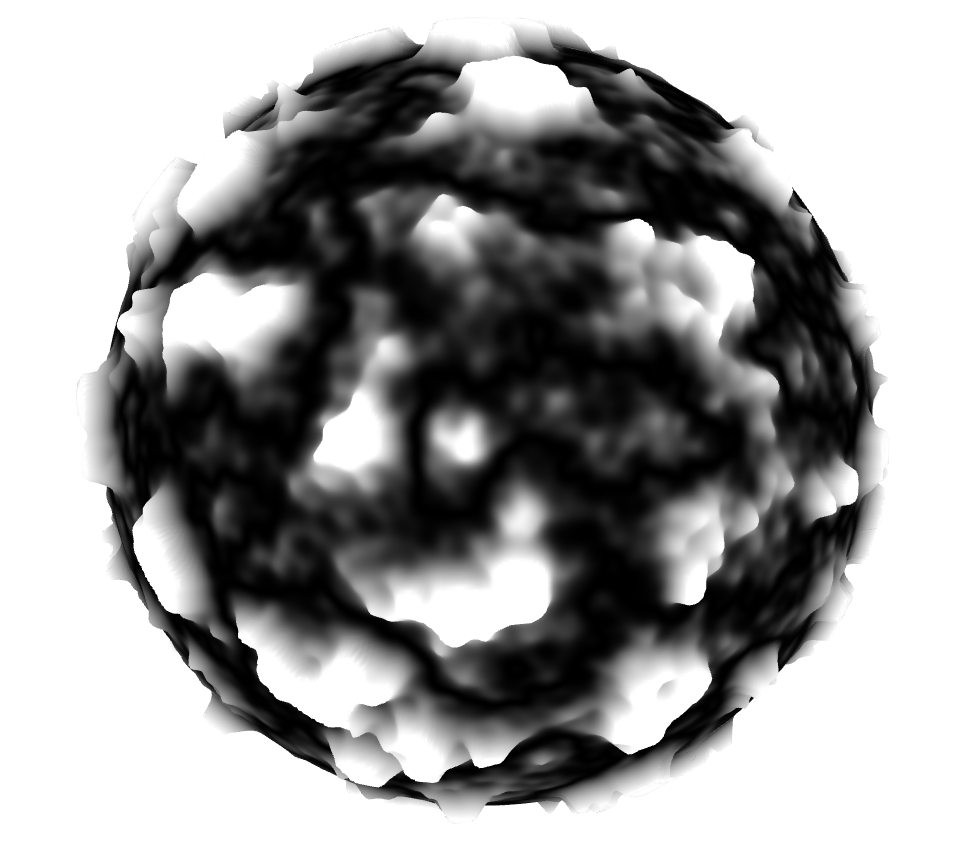
</p>

## How To Build A Planet
To build PlanetTechJS comes with an experimental feature called [CubeMapJS](./src/lib/core/textures/cubeMap). CubeMapJS allows users to create procedurally generated cube textures that return displacement maps and normal maps. CubeMapJS can generate displacement and normal maps in tangent space, as well as analytical noise derivatives that generate world space normal maps. CubeMapJS works by dividing the noise space into a tiled NxN grid, setting the resolution for each tile, allowing the camera to capture more detailed snapshots, resulting in better quality images.

```javaScript
  const displacmentMaps = new CubeMap(2000,3,false)
  const download = false
  displacmentMaps.build(3512)
  displacmentMaps.simplexNoiseFbm({
    inScale:            2.5,
    scale:              0.2,
    radius:             100,
    scaleHeightOutput:  0.1,
    seed:               0.0,
    normalScale:        .01,
    redistribution:      2.,
    persistance:        .35,
    lacunarity:          2.,
    iteration:            5,
    terbulance:       false,
    ridge:            false,
  })
  displacmentMaps.snapShot(download)
  let dt = displacmentMaps.textuerArray

  const normalMap = new CubeMap(2000,3,true)
  const download = false
  normalMap.build(2512)
  normalMap.simplexNoiseFbm({
    inScale:            2.5,
    scale:              0.2,
    radius:             100,
    scaleHeightOutput:  0.1,
    seed:               0.0,
    normalScale:        .01,
    redistribution:      2.,
    persistance:        .35,
    lacunarity:          2.,
    iteration:            5,
    terbulance:       false,
    ridge:            false,
  })
  normalMap.snapShot(download)
  let nt = normalMap.textuerArray

```

We initialize a cube map, setting the width and height of the noise space to 2000 and specifying that we want a 3x3 grid with a `mapType` set to `false` for displacement map and `true` for normal map. We then call the build method, creating the cube with the specified resolution of 3512 for this displacement map and 2512 for the normal map.

Next, we call one of the noise methods with the following parameters. Finally, we call the download method. If set to true, this method downloads the images to your computer. The `.textureArray` variable holds the images in memory. The order that the textures are in is `[front,back,right,left,top,bottom]`.

Load the images using `THREE.TextureLoader()`.

```javaScript
let N = [
  new THREE.TextureLoader().load('./planet/nf_image.png'),
  new THREE.TextureLoader().load('./planet/nb_image.png'),
  new THREE.TextureLoader().load('./planet/nr_image.png'),
  new THREE.TextureLoader().load('./planet/nl_image.png'),
  new THREE.TextureLoader().load('./planet/nt_image.png'),
  new THREE.TextureLoader().load('./planet/nbo_image.png'),
]

let D = [
  new THREE.TextureLoader().load('./planet/f_image.png'),
  new THREE.TextureLoader().load('./planet/b_image.png'),
  new THREE.TextureLoader().load('./planet/r_image.png'),
  new THREE.TextureLoader().load('./planet/l_image.png'),
  new THREE.TextureLoader().load('./planet/t_image.png'),
  new THREE.TextureLoader().load('./planet/bo_image.png'),
]
```

 The normal and displacement map for the front face.
<p align="center">
  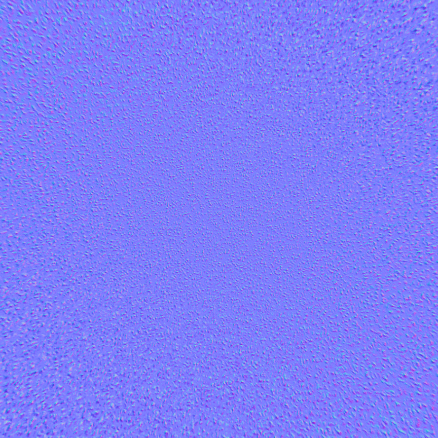
  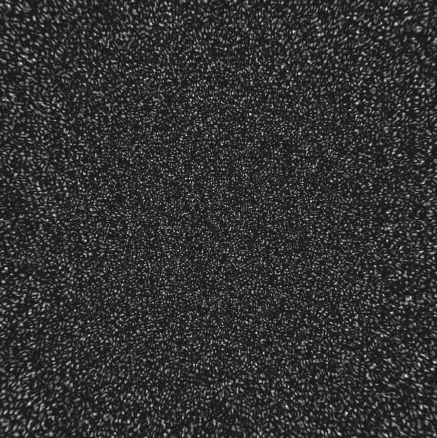
</p>


As shown previously, we set our parameters and then add our textures to each face of the sphere creating a planet. We then set a light direction for each face and finally add our planet to the scene.

```javascript

const params = {
  width:          10000,
  height:         10000,
  widthSegment:     50,
  heightSegment:    50,
  quadTreeDimensions: 1,
  levels:             5,
  radius:         10000,
  displacmentScale:  30,
}

let s = new Sphere(
  params.width,
  params.height,
  params.widthSegment,
  params.heightSegment,
  params.quadTreeDimensions
  )

s.build(
  params.levels,
  params.radius,
  params.displacmentScale,
)

s.front. addTexture([N[0],D[0]], params.displacmentScale)
s.back.  addTexture([N[1],D[1]], params.displacmentScale)
s.right. addTexture([N[2],D[2]], params.displacmentScale)
s.left.  addTexture([N[3],D[3]], params.displacmentScale)
s.top.   addTexture([N[4],D[4]], params.displacmentScale)
s.bottom.addTexture([N[5],D[5]], params.displacmentScale)

const ld = NODE.vec3(100.0,100.0,100.0)

s.front. lighting(ld)
s.back.  lighting(ld)
s.right. lighting(ld)
s.left.  lighting(ld)
s.top.   lighting(ld)
s.bottom.lighting(ld)

this.allp = [
  ...s.front .instances,
  ...s.back  .instances,
  ...s.right .instances,
  ...s.left  .instances,
  ...s.top   .instances,
  ...s.bottom.instances,
]

this.rend.scene_.add(s.sphere);

//In our update loop we need to add this chunk of code to actiavte the quadtree

update(t) {
  if(s){
    for (var i = 0; i < this.allp.length; i++) {
      this.allp[i].update(/*player or camera object*/)
    }
}
requestAnimationFrame(this.update.bind(this));
nodeFrame.update();
this.rend.renderer.render(this.rend.scene_, this.rend.camera_);
}

```
## Additional features
Calling `s.log()` returns an object that contains all the important data for the planet engine. This data is what's being shared to instruct the quadtree on what to do. Here, you can see the data we generated for our planet.

<p align="center">
  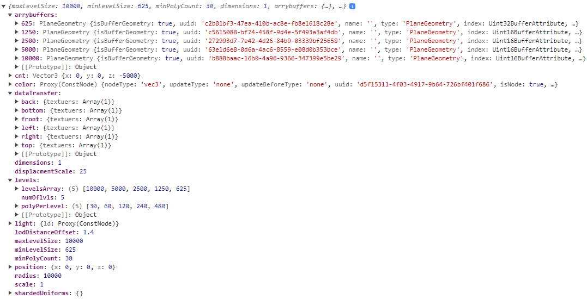
</p>

- `arrayBuffers` contains all the geometry for each level, with the key being the dimensions of the mesh.
- `cnt` represents the center of our sphere.
- `color` is the default color.
- `dataTransfer` holds our textures for each face of the planet.
- `dimensions` is the number of dimensions for each face.
- `displacementScale` for our texture.
- `levels` holds `levelsArray`, with each item representing the dimensions of the mesh at each level. `polyPerLevel` tells you the polygon count of the mesh at each level.
- `maxLevelSize` represents the largest mesh size.
- `minLevelSize` represents the smallest mesh size.
- `minPolyCount` represents the smallest polygon count.
- `position` is the position of the planet.
- `radius` is the radius of the planet.
- `scale` is the scale of the planet.

<p align="center">
  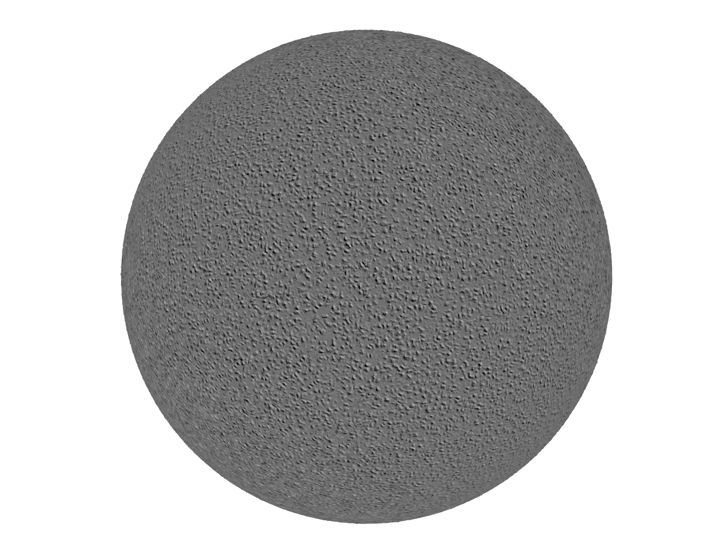
</p>

Here is a video of our planet. The 1 meter red cube is used to visualize the scale/percision of the height map.

https://github.com/miguelmyers8/PlanetTechJS/assets/18605314/b6ad90b5-5664-4a3a-b535-d3bcbc542d35

⚠️ **Disclaimer:** CubeMapJS isn't optimized yet; increasing the grid size or resolution to a large amount can cause WebGL to crash and may result in a lost context. You have to find a balance between visual appeal and performance. Additionally, in some cases, the normal map can create seams between each face of the texture, which can break immersion for the user. Sometimes, these seams can be ignored because they are negligible.


<p align="center">
  World space normal:
  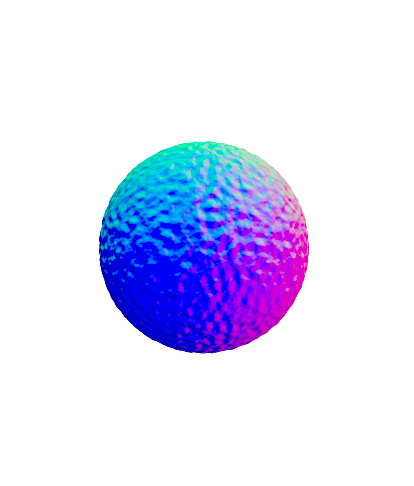
  World space normal with light:
  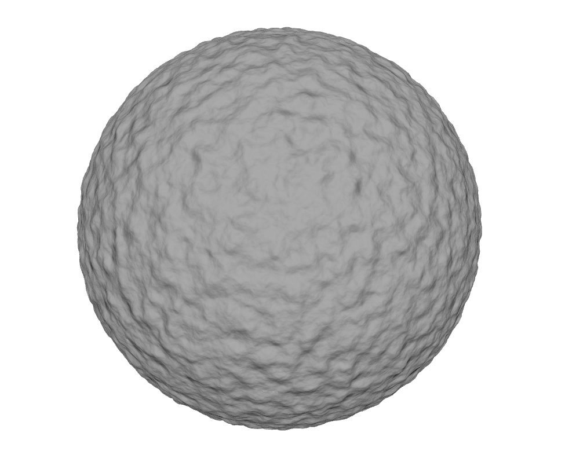
</p>

<p align="center">
  tangent space normal:
  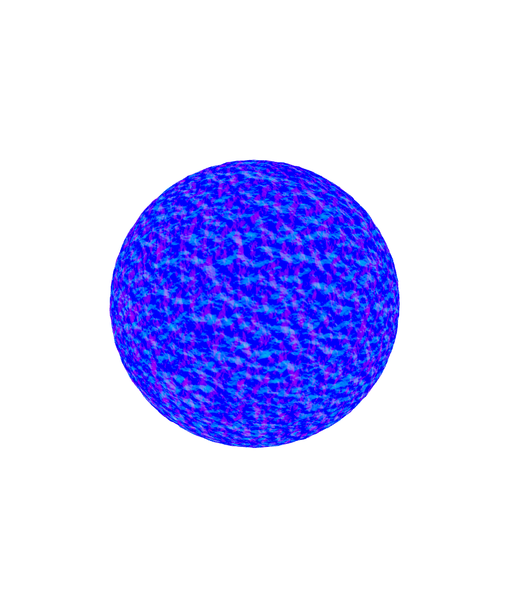
  tangent space normal with light:
  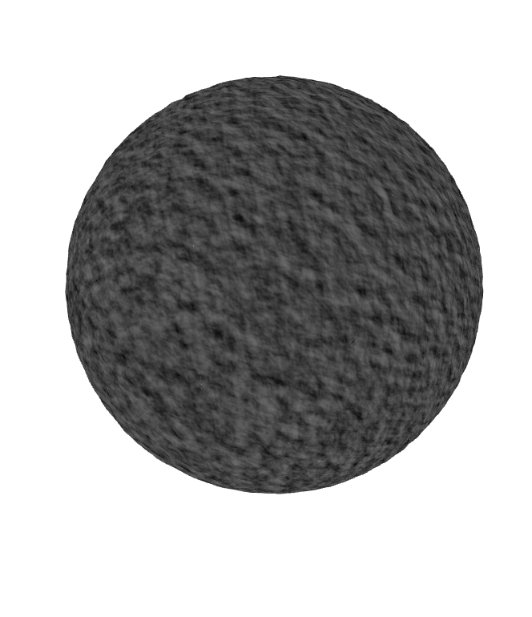
</p>


<p align="center">
  Here is a Star Citizen planet using there planet tech.
  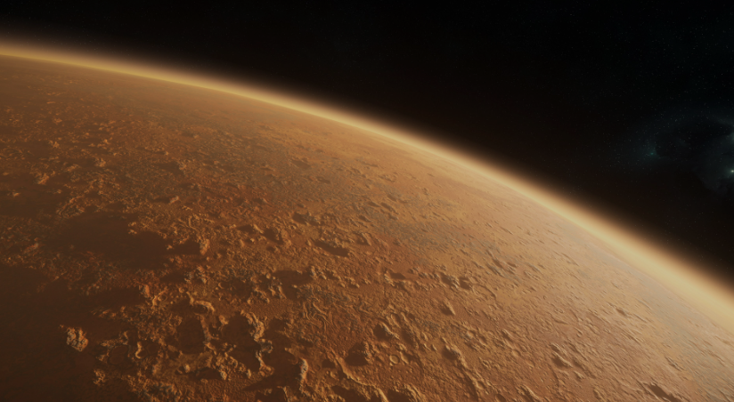
  And here his PlanetTechJS along with CubeMapJS trying to replicate the same look and scale for the terrain.
  
  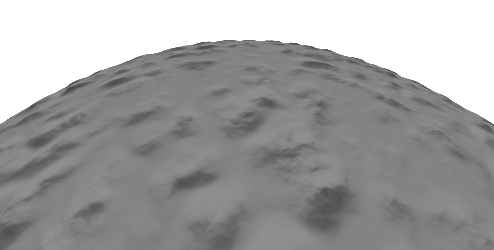
</p>


## Contributing

Contributions are welcome! If you find a bug, have an enhancement suggestion, or would like to add new features, feel free to open issues and pull requests in this repository.

## Apache License 2.0.
[License](./LICENSE.txt)
This license  allows contributions to be open-source  while also ensuring that the project as a whole remains open and accessible to others.
Under the Apache License 2.0, contributors retain the copyright to their individual contributions while granting a license to others to use, modify, and distribute the project as a whole. This means that someone cannot claim the entire project as their own, but they can claim ownership of their individual contributions.
