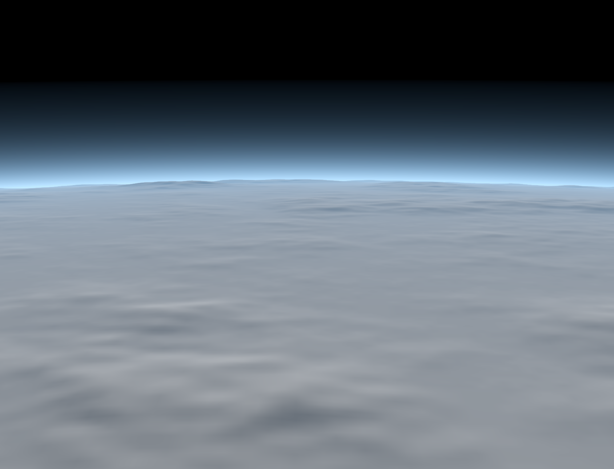
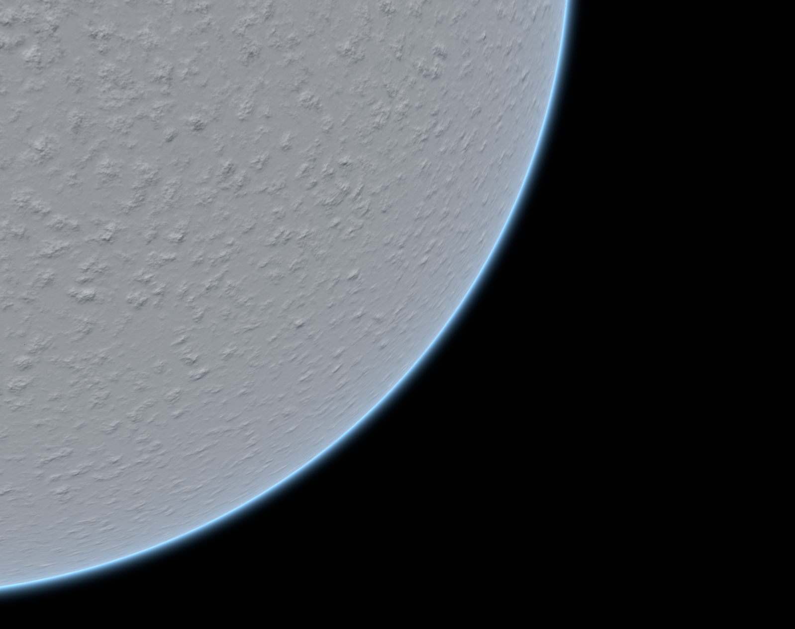

⚠️ **Disclaimer:** PlanetTechJS is currently in its alpha version and is being developed by a single developer. Consequently, it's important to keep in mind that there may be bugs, spelling errors, lack of tests, and occasional inconsistencies in the library. While every effort is being made to provide a stable and enjoyable experience, please approach the library with the understanding that it's a work in progress. Your feedback, bug reports, and contributions are highly appreciated as they play a crucial role in improving the library and ensuring its quality.


# PlanetTechJS (ALPHA V0.5) 
<p align="center">
  
</p>


**GOAL:**
PlanetTechJS is an open-source JavaScript library built using vanilla THREE.js, accompanied by a React UI for editing planets. Its primary purpose is to generate procedural planets and terrains using a quadtree LOD approach. The aim of this project is not to replicate titles like Star Citizen or No Man's Sky, but rather to provide a toolkit that emulates the tools they might employ for planet creation. The sole focus is on crafting planets, offering a straightforward and adaptable approach to designing realistic and visually captivating 3D planets on a grand scale. The key to the success of this project lies in its ability to handle **scale**, allowing for seamless transitions from the sky to the ground with high resolution. PlanetTechJS will include customizable features such as terrain textures, ground physics, atmospheric effects, and more. Thus, it does not encompass spaceships, weapons, player dynamics, etc.; its sole focus is planet generation.

What sets this library apart is its utilization of the GPU for all tasks. This includes generating textures for each facet, performing displacement, and shaping PlaneGeometries into spherical forms; the entire process occurs on the GPU. Consequently, there is no need for WebWorkers at this stage.

## Doc
Read the [Doc](./DOC.md) for a low level understanding of how things work.

## Getting Started
Download and run the project. Go to http://localhost:3001/. The file for the demo is located at src/lib/viewGL.js. If things aren't working, open an issue, and I will try to correct any problems.

## Basic Usage
```javascript
import renderer from './render';
import { getRandomColor,hexToRgbA } from './PlanetTech/engine/utils'
import { Moon } from './PlanetTech/celestialBodies/moon';
import { nodeFrame }  from 'three/addons/renderers/webgl-legacy/nodes/WebGLNodes.js';

let moon 
let player = /*object that can move, camera or object3D.*/
let rend = renderer;
rend.WebGLRenderer(canvasViewPort);
rend.scene();
rend.stats();
rend.camera();
rend.updateCamera(0,0,110005)
rend.orbitControls()

async function init(){
  let D = await Promise.all([
    new THREE.TextureLoader().loadAsync('./planet/displacement/right_displacement_image.png'),
    new THREE.TextureLoader().loadAsync('./planet/displacement/left_displacement_image.png'),
    new THREE.TextureLoader().loadAsync('./planet/displacement/top_displacement_image.png'),
    new THREE.TextureLoader().loadAsync('./planet/displacement/bottom_displacement_image.png'),
    new THREE.TextureLoader().loadAsync('./planet/displacement/front_displacement_image.png'),
    new THREE.TextureLoader().loadAsync('./planet/displacement/back_displacement_image.png'),
  ])

let N = await Promise.all([
    new THREE.TextureLoader().loadAsync('./planet/normal/right_normal_image.png'),
    new THREE.TextureLoader().loadAsync('./planet/normal/left_normal_image.png'),
    new THREE.TextureLoader().loadAsync('./planet/normal/top_normal_image.png'),
    new THREE.TextureLoader().loadAsync('./planet/normal/bottom_normal_image.png'),
    new THREE.TextureLoader().loadAsync('./planet/normal/front_normal_image.png'),
    new THREE.TextureLoader().loadAsync('./planet/normal/back_normal_image.png'),
  ])

moon = new Moon({
  size:            10000,
  polyCount:          50,
  quadTreeDimensions:  4,
  levels:              4,
  radius:          80000,
  displacmentScale: 80.5,
  lodDistanceOffset: 7.4,
  material: new NODE.MeshBasicNodeMaterial(),
})

moon.textuers(N,D)
moon.light(NODE.vec3(0.0,-6.5,6.5))
rend.scene_.add(moon.sphere)
}

function update(t) {
  moon.update(player)
  nodeFrame.update()
  rend.renderer.render(rend.scene_, rend.camera_)
}

init()
update()
```


<p align="center">
  
  
  
  
  
</p>
