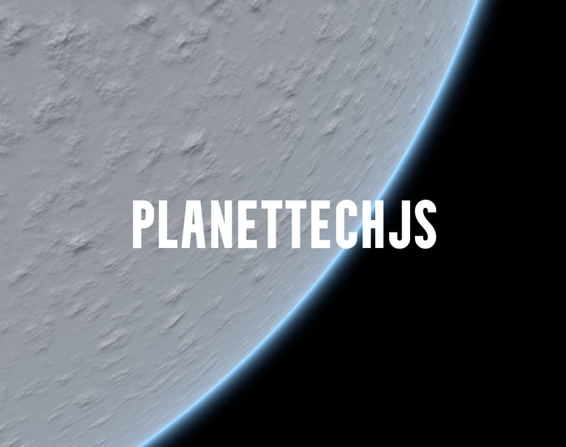

⚠️ **Disclaimer:** PlanetTech is currently in its alpha version and is being developed by a single developer. Consequently, it's important to keep in mind that there may be bugs, spelling errors, lack of tests, and occasional inconsistencies in the library. While every effort is being made to provide a stable and enjoyable experience, please approach the library with the understanding that it's a work in progress. Your feedback, bug reports, and contributions are highly appreciated as they play a crucial role in improving the library and ensuring its quality.


# PlanetTech (ALPHA V0.8) 
This is the [official demo](https://interstellarjs.github.io/PlanetTech/examples/). It's under construction. Features will be added incrementally.
<p align="center">
  
</p>


## Goal

This video served as the motivation for the project. I would like to design a system/toolkit that gets as close as possible to what is demoed.

[](https://www.youtube.com/watch?v=ksMQ4hYhfSA)

**About:**
PlanetTech is an open-source JavaScript library built using vanilla THREE.js, accompanied by a React UI for editing planets. Its primary purpose is to generate procedural planets and terrains using a quadtree LOD approach. The aim of this project is not to replicate titles like Star Citizen or No Man's Sky, but rather to provide a toolkit that emulates the tools they might employ for planet creation. The sole focus is on crafting planets, offering a straightforward and adaptable approach to designing realistic and visually captivating 3D planets on a grand scale. The key to the success of this project lies in its ability to handle **scale**, allowing for seamless transitions from the sky to the ground with high resolution. PlanetTech will include customizable features such as terrain textures, ground physics, atmospheric effects, and more. Thus, it does not encompass spaceships, weapons, player dynamics, etc.; its sole focus is planet generation.

What sets this library apart is its utilization of the GPU for all tasks. This includes generating textures for each facet, performing displacement, and shaping PlaneGeometries into spherical forms; the entire process occurs on the GPU. Consequently, there is no need for WebWorkers at this stage.

## Getting Started
To run the basic example:
```
$ git clone https://github.com/InterstellarJS/PlanetTech.git
$ cd PlanetTech/examples
$ python3 -m http.server
```
Past `http://localhost:8000/` into the browser.

https://github.com/miguelmyers8/PlanetTech/assets/18605314/f4621d3a-85ff-4224-be1f-8ae059b7efcc


## Build From Source
If you would like to work on this, here is a example of how to get it working in your react project.
The first thing you need to do is install it locally. 
Copy the coi-serviceworker.js file from ./examples and paste it in the root directory or public folder where your index.html file is located,
then link to it. Afterward, run the following commands.
```
$ cd ./to/your/projects/root
$ git clone https://github.com/InterstellarJS/PlanetTech.git
$ cd PlanetTech
$ npm link
$ cd ..
$ npm link @interstellar-js-core/planettech && npm install
```


