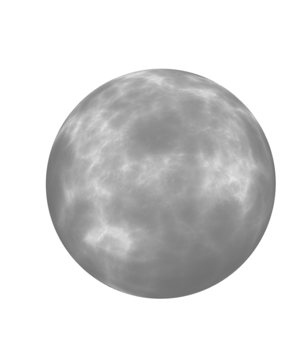
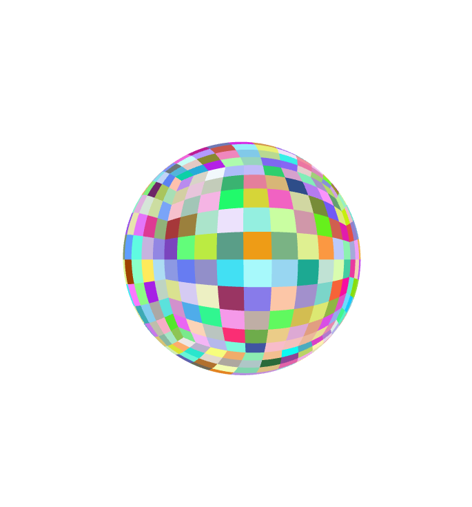

# WorldTechJS



WorldTechJS is a JavaScript library for generating procedural planets and terrains. It provides a simple and flexible way to create realistic and visually appealing 3D planets with customizable features such as terrain height, textures, and atmospheric effects.


## Features
- Procedural planet generation: Create unique and realistic planets using procedural algorithms.
- flexability and speed.
- quadtree sphere.
- Terrain generation: Generate detailed and customizable terrains with different types of landscapes such as mountains, valleys, and plains.
- Texture mapping: Apply textures to the terrain to enhance visual realism and add visual variety.
- Gpu generated normal map.
- Gpu generated displacement map.
- Atmospheric effects: Simulate atmospheric effects such as clouds, haze, and lighting to create a more immersive environment.
- User interaction: Allow users to interact with the generated planet by zooming, rotating, and exploring different regions.


## Examples
Let's create a basic quadtree sphere without any textures or displacement, just coloring each dimension to show what's going on under the hood.
```javascript

import Sphere from './core/sphere/sphere'

  const params = {
    width: 100,
    height: 100,
    widthSegment: 50,
    heightSegment: 50,
    quadTreeDimensions: 1,
    levels: 10,
    radius: 100,
 }


 let s = new Sphere(
    params.width,
    params.height,
    params.widthSegment,
    params.heightSegment,
    params.quadTreeDimensions
    )

  s.build(
    params.levels,
    params.radius,
  )

 scene.add(s.sphere);

```


Now let's crank up the `levels` all the way to 10 (a reasonable number without my machine freezing up). So you'll be creating a sphere with 10x10x6 dimensions at a resolution of 50. You can play with the parameters to fit your needs; the only limitation is your machine.



To get a better understanding of the `levels` parameter, let's take a look at a single quad (single dimension), Without the projection and a simple height map texture. Setting `params.levels = 6` gives a single dimension the ability to go six levels deep. As you can see each child in each level with a random color. 

