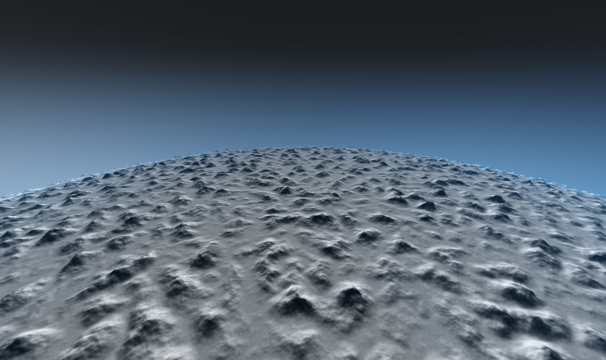

⚠️ **Disclaimer:** PlanetTechJS is currently in its alpha version and is being developed by a single developer. Consequently, it's important to keep in mind that there may be bugs, spelling errors, lack of tests, and occasional inconsistencies in the library. While every effort is being made to provide a stable and enjoyable experience, please approach the library with the understanding that it's a work in progress. Your feedback, bug reports, and contributions are highly appreciated as they play a crucial role in improving the library and ensuring its quality.


# PlanetTechJS (ALPHA V0.0) 


<p align="center">
  
</p>


**GOAL:**
PlanetTechJS is an open-source JavaScript library built using vanilla THREE.js, accompanied by a React UI for editing planets. Its primary purpose is to generate procedural planets and terrains using a quadtree LOD approach. The aim of this project is not to replicate titles like Star Citizen or No Man's Sky, but rather to provide a toolkit that emulates the tools they might employ for planet creation. The sole focus is on crafting planets, offering a straightforward and adaptable approach to designing realistic and visually captivating 3D planets on a grand scale. The key to the success of this project lies in its ability to handle **scale**, allowing for seamless transitions from the sky to the ground with high resolution. PlanetTechJS will include customizable features such as terrain textures, ground physics, atmospheric effects, and more. Thus, it does not encompass spaceships, weapons, player dynamics, etc.; its sole focus is planet generation.

What sets this library apart is its utilization of the GPU for all tasks. This includes generating textures for each facet, performing displacement, and shaping PlaneGeometries into spherical forms; the entire process occurs on the GPU. Consequently, there is no need for WebWorkers at this stage.

## Getting Started
Download and run the project. Go to http://localhost:3001/. The file for the demo is located at src/lib/viewGL.js. If things aren't working, open an issue, and I will try to correct any problems.


## Features/Ideas
- Procedural planet generation: Create unique and realistic planets using procedural algorithms.
- flexability and speed.
- quadtree sphere.
- CDLOD. (coming soon)
- custom frustum culling. (coming soon)
- raycasting mannequin. (coming soon)
- cubeMap. (threading and instancing coming soon)
- Terrain generation: Generate detailed and customizable terrains with different types of landscapes such as mountains, valleys, and plains.
- Texture mapping: Apply textures to the terrain to enhance visual realism and add visual variety.(coming soon)
- Gpu generated normal map.
- Gpu generated displacement map.
- Atmospheric effects: Simulate atmospheric effects such as clouds, haze, and lighting to create a more immersive environment.(dev complete)
- day and night cycle.(coming soon)
- weather simulation.(coming soon)
- Texture editing / terrain editing. (coming soon)
- Texture Atlas. (dev complete)
- Texture channel packing.(dev complete)
- Texture Splat Map.(dev complete)
- Physics. (coming soon)
- assets.  (coming soon)
- foliage. (coming soon)
- ability to switch from WebGL to WebGPU backended. (dev complete)
- logs.

## Specs
- Recommended GPU is GTX 1060 and above.

# How It Works
The PlanettechJS repository contains two libraries: PlanetTech itself and CubeMap. Both PlanetTech and CubeMap are built using ThreeJS experimental NodeMaterial.
Additionally, PlanetTech requires you to use the `render` object. With the `render` object, you can switch between the **WebGL**: `render.WebGLRenderer(canvasViewPort)` and **WebGPU**: `render.WebGPURenderer(canvasViewPort)`. You should stick with WebGL because WebGPU is still very experimental in ThreeJS and can cause issues with each version update.

- **PlanetTech**: Think of it as the backend. It handles planet system management, mesh creation, as well as the generation of quads and quadtree data structures from the `'./PlanetTech/engine'`.

- **CubeMap**: This serves as the frontend and primarily handles texture generation.

We will start with **PlanetTech**. Let's create a basic quadtree sphere without any textures or displacement, just coloring each dimension to show what's going on under the hood.
Let's create a basic quadtree sphere without any textures or displacement, just coloring each dimension to show what's going on under the hood.

```javascript
import renderer from './render';
import Sphere   from './PlanetTech/sphere/sphere'
import { getRandomColor,hexToRgbA } from './PlanetTech/engine/utils'

let rend = renderer;
rend.WebGLRenderer(canvasViewPort);
rend.scene();
rend.stats();
rend.camera();
rend.updateCamera(0,0,20000)
rend.orbitControls()

const params = {
width:          10000,
height:         10000,
widthSegment:      50,
heightSegment:     50,
quadTreeDimensions: 1,
levels:             1,
radius:         10000,
displacmentScale:   1,
lodDistanceOffset:1.4, 
color: () => NODE.vec3(...hexToRgbA(getRandomColor())),
}

let s = new Sphere(
params.width,
params.height,
params.widthSegment,
params.heightSegment,
params.quadTreeDimensions
)

s.build(
params.levels,
params.radius,
params.displacmentScale,
params.lodDistanceOffset,
params.color,
)

rend.scene_.add(s.sphere);
```


### Input Parameters

- `width`: Set the width of a quad.
- `height`: Set the height of a quad.
- `widthSegment`: Set the poly count for the width.
- `heightSegment`: Set the poly count for the height.
- `quadTreeDimensions`: Specify the number of top quads with which a sphere is initialized.
- `levels`: Determine how deep the quadtree should go.
- `radius`: Specify the sphere's radius.
- `displacementScale`: Set the texture displacement height.
- `lodDistanceOffset`: Specify the distance offset used to trigger the splitting of a quad.
- `color`: Apply a color to each quad.

### Dimensions 
Now let's crank up the `dimensions` all the way to 10 (a reasonable number without my machine freezing up). So you'll be creating a sphere with 10x10x6 dimensions at a resolution of 50. You can play with the parameters to fit your needs; the only limitation is your machine.


### Levels 
To get a better understanding of the `levels` parameter, let's take a look at a single quad (single dimension). If we were to grab a quad from our sphere without the projection so its a flat plane, and adding a simple height map texture. Setting `params.levels = 6` gives a single dimension the ability to go six levels deep. As you can see each child in each level with a random color. 


# CubeMap
⚠️ **Disclaimer:** CubeMap isn't optimized yet; increasing the grid size or resolution to a large amount can cause the renderer to crash and may result in a lost context. You have to find a balance between visual appeal and performance. Additionally, in some cases, the normal map can create seams between each face of the texture, which can break immersion for the user. Sometimes, these seams can be ignored because they are negligible.

To build something the resembles a planet, PlanetTechJS comes with an experimental feature called [CubeMap](./src/lib/cubeMap). CubeMap allows users to create procedurally generated cube textures that return displacement maps or normal maps. CubeMap can generate displacement and normal maps in tangent space, as well as analytical noise derivatives that generate world space normal maps. CubeMap works by dividing the noise space into a tiled NxN grid, setting the resolution for each tile, allowing the camera to capture more detailed snapshots, resulting in better quality images.
You can think of PlanetTechJS as the back-end and CubeMap as the front-end of the planet creation process.

We initialize a cube map, setting the width and height of the noise space to 2000 and specifying that we want a 3x3 grid with a `mapType` set to `false` for displacement map and `true` for normal map. We then call the build method, creating the cube with the specified resolution of 3512 for this displacement map and 2512 for the normal map.

Next, we call one of the noise methods with the following parameters. Finally, we call the download method. If set to true, this method downloads the images to your computer. The `.textureArray` variable holds the images in memory. The order that the textures are in is `[front,back,right,left,top,bottom]`. If you choose to download the images you can load them using `THREE.TextureLoader()`, and put them in the correct order PlanetTech uses.

```javaScript
const displacmentMaps = new CubeMap(2000,3,false)
const download = false
displacmentMaps.build(3512)
displacmentMaps.simplexNoiseFbm({
inScale:            2.5,
scale:              0.2,
radius:             100,
scaleHeightOutput:  0.1,
seed:               0.0,
normalScale:        .01,
redistribution:      2.,
persistance:        .35,
lacunarity:          2.,
iteration:            5,
terbulance:       false,
ridge:            false,
})
displacmentMaps.snapShot(download)
let D = displacmentMaps.textuerArray

const normalMap = new CubeMap(2000,3,true)
const download = false
normalMap.build(2512)
normalMap.simplexNoiseFbm({
inScale:            2.5,
scale:              0.2,
radius:             100,
scaleHeightOutput:  0.1,
seed:               0.0,
normalScale:        .01,
redistribution:      2.,
persistance:        .35,
lacunarity:          2.,
iteration:            5,
terbulance:       false,
ridge:            false,
})
normalMap.snapShot(download)
let N = normalMap.textuerArray
```

 The normal and displacement map for the front face.
<p align="center">
  
  
</p>


As shown previously we build the Sphere then set the textures or each face, add a light direction for each face, finally add our Sphere to the scene.
```javaScript
const params = {
width:          10000,
height:         10000,
widthSegment:      50,
heightSegment:     50,
quadTreeDimensions: 1,
levels:             1,
radius:         10000,
displacmentScale:   1,
lodDistanceOffset:1.4, 
//color: () => NODE.vec3(...hexToRgbA(getRandomColor())), no longer needed
}

let s = new Sphere(
params.width,
params.height,
params.widthSegment,
params.heightSegment,
params.quadTreeDimensions
)

s.build(
params.levels,
params.radius,
params.displacmentScale,
params.lodDistanceOffset,
params.color,
)

s.front. addTexture([N[0],D[0]], params.displacmentScale)
s.back.  addTexture([N[1],D[1]], params.displacmentScale)
s.right. addTexture([N[2],D[2]], params.displacmentScale)
s.left.  addTexture([N[3],D[3]], params.displacmentScale)
s.top.   addTexture([N[4],D[4]], params.displacmentScale)
s.bottom.addTexture([N[5],D[5]], params.displacmentScale)

const ld = NODE.vec3(0.0,50.0,50.0)

s.front. lighting(ld)
s.back.  lighting(ld)
s.right. lighting(ld)
s.left.  lighting(ld)
s.top.   lighting(ld)
s.bottom.lighting(ld)
```

<p align="center">
  
</p>

Here is a video of our planet. The 1 meter red cube is used to visualize the scale/percision of the height map.

https://github.com/miguelmyers8/PlanetTechJS/assets/18605314/b6ad90b5-5664-4a3a-b535-d3bcbc542d35


# Celestial Bodies
The `celestialBodies` is simply a wrapper around the process we just completed.
It is meant to serve as the main interface for a user to create celestial bodies such as `Planet`, `Moon`, and `Sun`.
A `celestialBodies` is initialize with a `object` and a `name`.

```javaScript
let N = [...]
let D = [...]
    
let planet = new Planet({
  width:          10000,
  height:         10000,
  widthSegment:      30,
  heightSegment:     30,
  quadTreeDimensions: 1,
  levels:             5,
  radius:         10000,
  displacmentScale:  25,
  lodDistanceOffset:1.4,
},'Terranox')

planet.textuers(N,D)
planet.light   (NODE.vec3(0.0,20.0,20.0))
let quads = planet.getAllInstance()
rend.scene_.add(planet.sphere);
```

# Atomsphere Scattering

To add a atomsphere to a planet 

```javaScript
import { Atmosphere } from './PlanetTech/shaders/vfx/atmosphereScattering';

let atmosphere = new Atmosphere() 
atmosphere.createcomposer(planetRadius,planetCenterPosition,atomsphereRadius)

//update loop
  update(t) {
    requestAnimationFrame(this.update.bind(this));
    if(this.planet){
      this.controls.update(this.clock.getDelta())
      for (var i = 0; i < this.quads.length; i++) {
      this.quads[i].update(this.player)
      }
    }
    atmosphere.run()
    nodeFrame.update();
    this.rend.renderer.render(this.rend.scene_, this.rend.camera_);
  }
```
<p align="center">
  Here is PlanetTechJS using CubeMapJS and Atmosphere.
  
  
  
  
</p>


# Debugging
For debugging Calling `Sphere.log()` method returns an object that contains all the important data for the Sphere engine. This data is what's being shared to instruct the quadtree on what to do. Here, you can see the data we generated for our planet.

<p align="center">
  
</p>

- `arrayBuffers` contains all the geometry for each level, with the key being the dimensions of the mesh.
- `cnt` represents the center of our sphere.
- `color` is the default color.
- `dataTransfer` holds our textures for each face of the planet.
- `dimensions` is the number of dimensions for each face.
- `displacementScale` for our texture.
- `levels` holds `levelsArray`, with each item representing the dimensions of the mesh at each level. `polyPerLevel` tells you the polygon count of the mesh at each level.
- `maxLevelSize` represents the largest mesh size.
- `minLevelSize` represents the smallest mesh size.
- `minPolyCount` represents the smallest polygon count.
- `position` is the position of the planet.
- `radius` is the radius of the planet.
- `scale` is the scale of the planet.